# Intro to Using Spark Mllib With Pipelines

This is a quick (in-progress) guide to using Spark Mllib with Python (Scala coming soon). It is meant to be a step between the basic examples in the documentation and the most advanced models available online. 


## Disambiguation: What is Spark Mllib?
MLLib is often referred to as Apache Spark's machine learning library. However, take note that there are two of them at the moment: `pyspark.mllib` and `pyspark.ml`. Both of these are colloquially referred to as `mllib`. Please please be careful when googling and make sure you are reading about the correct library.

### `pyspark.mllib` vs `pyspark.ml`
In short, try to use use `pyspark.ml`. This is becuase `pyspark.mllib` is outdated and is in maintencne mode.
In more detail, `pyspark.mllib` is RDD-based, and `pyspark.ml` is DataFrame-based and supposed ml pipelines. 

## mllib vs scikit-learn
Both are very good options, but mllib can leverage spark and can work on data that cannot fit into memory. However, the ecosystem is significantly weaker and a lot of the more popular models are not available out of the box (such as `xgboost`, which you need to install a 3rd party to run).

Long story short, if you data is way too big to handle, then maybe try mllib!

## Let's Build a Model Together!

### Summary
#### Our Dataset
From UC Irvine’s Machine Learning Repository)
Data from 1996 Census Dataset
https://archive.ics.uci.edu/ml/datasets/adult
(small snippet is included in this repo)

#### Our Task
Predict whether a person makes over 50k/year


### Using Spark Mllib to Build a Model

#### General Steps to Building a Model
1. Look at the data (data exploration) 
1. Identify desired features
1. Transform features to desired format for training algorithm
1. Train data using training algorithm
1. Run model on test data (out of sample validation)
1. Evaluate Model
1. Look at the Data


#### 1. Look at the data (data exploration) 

```
# load in the data
df = spark.read.csv("census_small_dataset.csv", header=True, inferSchema=True)
df.show()
```
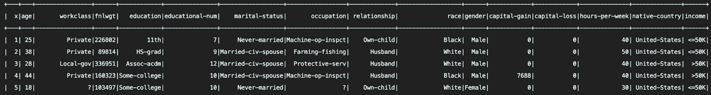

(For the sake of time, let’s say we already explored the data and know what we want for our features)

#### 2. Identify desired features

`df.printSchema()` gives us the following:

```
root
 |-- x: integer (nullable = true)
 |-- age: integer (nullable = true)
 |-- workclass: string (nullable = true)
 |-- fnlwgt: integer (nullable = true)
 |-- education: string (nullable = true)
 |-- educational-num: integer (nullable = true)
 |-- marital-status: string (nullable = true)
 |-- occupation: string (nullable = true)
 |-- relationship: string (nullable = true)
 |-- race: string (nullable = true)
 |-- gender: string (nullable = true)
 |-- capital-gain: integer (nullable = true)
 |-- capital-loss: integer (nullable = true)
 |-- hours-per-week: integer (nullable = true)
 |-- native-country: string (nullable = true)
 |-- income: string (nullable = true)
 ```

From there, we can identify some of the features that we want (let's just say we want all of them)

```
 age (continuous)
 workclass (categorical)
 fnlwgt (continuous)
 education (categorical)
 educational-num (continuous)
 marital-status (categorical)
 occupation (categorical)
 relationship (categorical)
 race (categorical)
 gender (categorical)
 capital-gain (continuous)
 capital-loss (continuous)
 hours-per-week (continuous)
 native-country (categorical)
 income (categorical)
 ```

#### 3. Transform Features to Desired Format

#### 3a. Handle categorical variables
We have a bunch of strings for the categorical variables. We need to put it into a numeric format  for our training algorithm.

We will need a `Transformer`.

`Transformers` converts one dataframe to another using the method .transform().
They provide a variety of different transformations that you will need for your model.

```
updated_dataframe = SomeTransformer(original_dataframe).transform()
```
**Examples:** `StringIndexer`, `IndexToString`, `Tokenizer`

Note: A trained model is a `Transformer`
**List of Transformers:** https://spark.apache.org/docs/latest/ml-features.html

For categorical variables, we will need a combination of two Transformers:

##### `StringIndexer`
- (similar to `sklearn.preprocessing.LabelEncoder`)
- Encodes a string column of labels to a column of label indices
- Assigns a unique index number to each distinct string it sees

##### `OneHotEncoderEstimator` (dont use OneHotEncoder--it is deprecated)
- (similar to `sklearn.preprocessing.OneHotEncoder`)
- Maps a column of label indices to a column of binary vectors, with at most a single one-value
- Turns each observation output from the StringIndexer to an array of indicator variables
- Kind of what happens under the hood when you make something a factor variable in R.


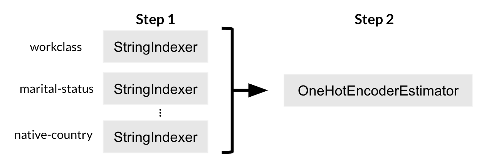


```
CAT_COLS = ['workclass', 'education', 'marital-status', 'occupation', 'relationship', 'race', 'gender', 'native-country']
STR_IDX_COLS = ['{}_string_indexed'.format(x) for x in CAT_COLS]
HOTENCODED_COLS = ['{}_hot_encoded'.format(x) for x in CAT_COLS]
string_indexers = [StringIndexer(inputCol=cat_col, outputCol=str_idx_col).fit(df) for cat_col, str_idx_col in zip(CAT_COLS, STR_IDX_COLS)]
hot_encoded = OneHotEncoderEstimator(inputCols=STR_IDX_COLS, outputCols=HOTENCODED_COLS)
```

#### 3b. Handle continuous variables

```
CONT_COLS = ['age', 'fnlwgt', 'capital-gain', 'educational-num', 'capital-loss', 'hours-per-week']
```
Don’t need to change anything in this case.


#### 3c. Collect Features to Desired Final Feature Format
Need another transformer to collect all features together.

We need a `VectorAssembler`. 

##### `VectorAssembler`
- combines a given list of columns into a single vector column.
- is meant to combine raw features and features generated by different feature transformers into a single feature vector. 
```
assembler = VectorAssembler(inputCols=HOTENCODED_COLS + CONT_COLS, outputCol="features")
```

Note that the output columns is just one column called `features`.


##### 3d. Format independent variable

We are predicting income and don’t want it collected with the rest of the features, so we are just going to handle it separately.


```
income_string_idx = StringIndexer(inputCol="income", outputCol="income_str_idx")
```

##### Summary:


 
#### 4. Train Data Using Training Algorithm


Now that we have our data in a model-friendly format, we are ready to train some models! 

Let’s try out Logistic Regression.
We will need an `Estimator`.

##### `Estimator`

Learning algorithm that trains or fits on data using `.fit()`

Examples of Estimators:
- `LogisticRegression`
- `RandomForestClassifier`
- `GBTClassifier`

Outputs a `Transformer` (which is why a trained model is considered a `Transformer`)

`LogisticRegression.fit()` returns `LogisticRegressionModel` which is a `Transformer`.

Basically, Trained Learning Algorithm = Transformer

**Estimators:** https://spark.apache.org/docs/latest/ml-classification-regression.html

Initialize estimators for logistic regression
```
lr = LogisticRegression(labelCol="income_str_idx", featuresCol="features")
```

Note that we are taking advantage of the fruits of our labor and using the columns that we created in our transformation step.
Let’s use a `Pipeline`.

`Pipeline`:
Very similar to `sklearn.pipeline.Pipeline`

`pyspark.ml.Pipeline`: Contains a workflow of a sequence of PipelineStages (`Transformers` and `Estimators`) to be run in a specific order.


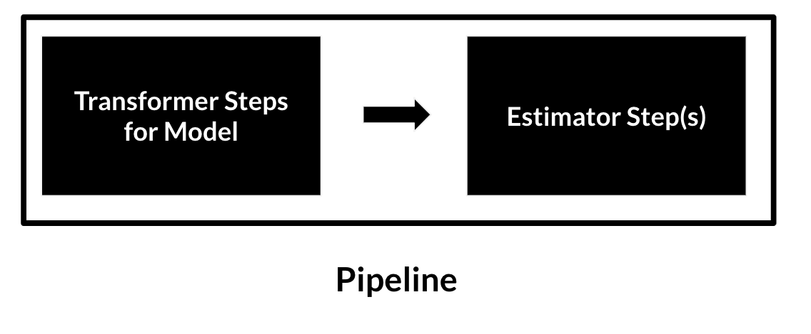


Now we need to gather all our transformers and estimators that we made and put them in a pipeline.

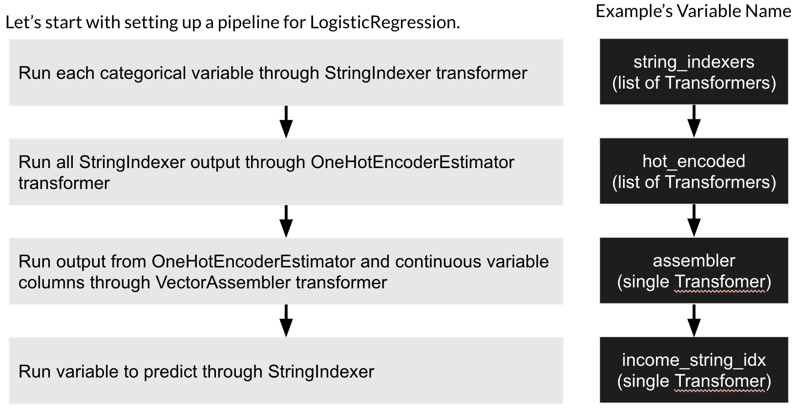


Let’s try to create the pipeline stages and the pipeline.

```
base_pipeline_stages = string_indexers + [hot_encoded, assembler, income_string_idx]
logistic_regression_pipeline = Pipeline(stages=base_pipeline_stages + [lr])
```


Now that we have the pipeline, let’s finally train our model!

```
train_data, test_data = df.randomSplit([.8, .2], seed=1234)
logistic_regression_model = logistic_regression_pipeline.fit(train_data)
```

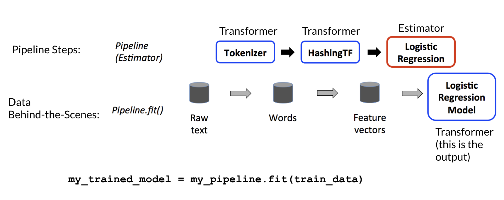

```
my_trained_model = my_pipeline.fit(train_data)
```


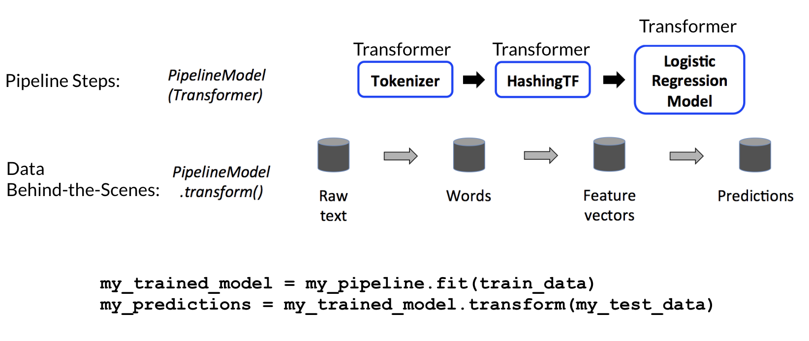

```
my_trained_model = my_pipeline.fit(train_data)
my_predictions = my_trained_model.transform(my_test_data)
```


To see details of your trained model, you will have to access the model stage first and then call whatever commands you want against it. 

```
print("Coefficients: " + str(logistic_regression_pipeline_model.stages[-1].coefficients))
print("Intercept: " + str(logistic_regression_pipeline_model.stages[-1].intercept))
```

Output:
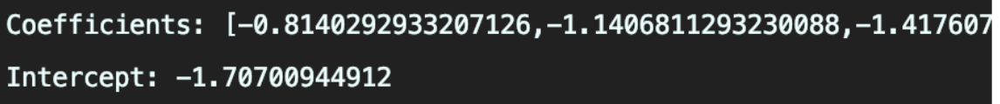


#### 5. Predict Label Using Trained Model

Use your newly trained model (which is now a transformer) to score your data

```
logistic_regression_predictions = logistic_regression_pipeline_model.transform(test_data)
```

Let’s take a look at our results!


```
logistic_regression_predictions_selected = logistic_regression_predictions\
   .select(CAT_COLS + CONT_COLS + ["income", "income_str_idx", "prediction", "probability"])
logistic_regression_predictions_selected.show(30)
logistic_regression_predictions_selected.groupby('income').agg({'income': 'count'}).show()
```
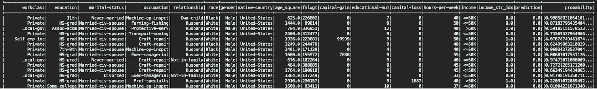
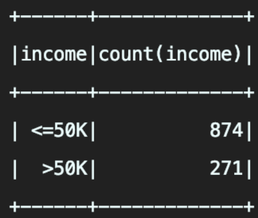


#### 6. Evaluate Model
Let’s build a model using Spark Mllib!

```
lr_pred = logistic_regression_predictions.select("income_str_idx", "prediction")
lr_accuracy_rate = lr_pred.filter(lr_pred.income_str_idx == lr_pred.prediction).count() / (lr_pred.count() * 1.0)
print("Overall Accuracy: {}".format(lr_accuracy_rate))
```
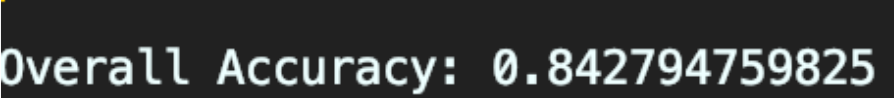

```
evaluator = BinaryClassificationEvaluator(rawPredictionCol="rawPrediction", labelCol='income_str_idx')
print('{}: {}'.format(evaluator.getMetricName(), evaluator.evaluate(logistic_regression_predictions)))
```
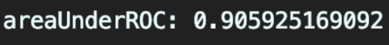


Many other model validation options available

#### Saving Model for Later

```
logistic_regression_pipeline_model.write().overwrite().save('my_logistic_regression_model.model')
loaded_lr_model = PipelineModel.load("my_logistic_regression_model.model")
more_predictions = loaded_lr_model.transform(test_data)
print("Coefficients: " + str(loaded_lr_model.stages[-1].coefficients))
print("Intercept: " + str(loaded_lr_model.stages[-1].intercept))
lr_pred = more_predictions.select("income_str_idx", "prediction")
print(lr_pred.filter(lr_pred.income_str_idx == lr_pred.prediction).count() / (lr_pred.count() * 1.0))
```
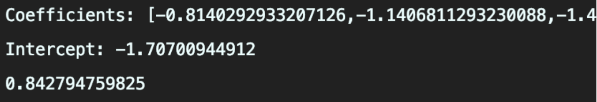
We get the same thing.

You can save your trained model to be used later. Just load it in and then use it as a `Transformer`.


#### Ease of Pipelines
```
rf = RandomForestClassifier(labelCol="income_str_idx", featuresCol="features")
random_forest_pipeline = Pipeline(stages=base_pipeline_stages + [rf])
```

We can repeat this whole thing again with a different estimator.

**Additional Notes:**
You can chain evaluators together in a pipeline to have the output of one model feed into another
You can write your own Transformer and Evaluator by inheriting from their class.
